# DB Schema
> Generated by [`prisma-markdown`](https://github.com/samchon/prisma-markdown)

- [default](#default)

## default

```mermaid
erDiagram
"CrewIdentity" {
  String id PK
  String email UK
  String password "nullable"
  String lastName "nullable"
  String firstName "nullable"
  Role roles
  DateTime createdAt
  DateTime updatedAt
}
"PassengerUser" {
  String id PK
  String email UK
  String firstName
  String lastName
  String password "nullable"
  DateTime createdAt
  DateTime updatedAt
}
"PNRGOVMessage" {
  String id PK
  String echoToken "nullable"
  DateTime timeStamp "nullable"
  String target "nullable"
  String version "nullable"
  String transactionIdentifier UK "nullable"
  Int sequenceNmbr "nullable"
  String transactionStatusCode "nullable"
  String primaryLangID "nullable"
  String altLangID "nullable"
  Boolean retransmissionIndicator "nullable"
  String correlationID UK "nullable"
  String schemaVersion "nullable"
  DateTime createdAt
  DateTime updatedAt
}
"Originator" {
  String id PK
  String airlineCode
  String systemCode
  String airlineContactInfo "nullable"
  String pnrGovMessageId FK,UK
}
"FlightLeg" {
  String id PK
  String carrierCode
  String flightNumber
  DateTime departureDateTime
  DateTime arrivalDateTime
  String dateChangeNbr "nullable"
  String operationalSuffix "nullable"
  String departureAirportId FK "nullable"
  String arrivalAirportId FK "nullable"
  String operatingAirlineId FK "nullable"
  String marketingAirlineId FK "nullable"
  String pnrGovMessageId FK,UK
}
"AirportInfo" {
  String id PK
  String locationCode
  String codeContext "nullable"
}
"OperatingAirlineInfo" {
  String id PK
  String companyShortName "nullable"
  String travelSector "nullable"
  String code
  String codeContext "nullable"
  String flightNumber "nullable"
  String resBookDesigCode "nullable"
}
"MarketingAirlineInfo" {
  String id PK
  String companyShortName "nullable"
  String travelSector "nullable"
  String code
  String codeContext "nullable"
}
"EquipmentInfo" {
  String id PK
  String airEquipType
  Boolean changeOfGauge "nullable"
  String flightLegId FK
}
"PNRsContainer" {
  String id PK
  Int numberOfPnrs
  String pnrGovMessageId FK,UK
}
"PNR" {
  String id PK
  Int numberOfPassengers
  DateTime pnrTransDate "nullable"
  DateTime pnrCreationDate "nullable"
  DateTime lastTktDate "nullable"
  String pnrsContainerId FK
  String unstructuredPnrHistory "nullable"
}
"UniqueId" {
  String id PK
  String url "nullable"
  String type "nullable"
  String companyId FK "nullable"
  String bookingRefId UK "nullable"
  String requestorId UK "nullable"
  String pnrHistoryCreditId UK "nullable"
}
"Company" {
  String id PK
  String companyShortName "nullable"
  String travelSector "nullable"
  String code
  String codeContext "nullable"
}
"BookingRef" {
  String id PK
  String uniqueIdDetailsId FK,UK
  String pnrId FK "nullable"
  String flightSegmentId FK "nullable"
}
"SSRItem" {
  String id PK
  String ssrCode
  Int serviceQuantity "nullable"
  String status "nullable"
  String boardPoint "nullable"
  String offPoint "nullable"
  String rph "nullable"
  String surnameRefNumber "nullable"
  String text "nullable"
  String airlineId FK "nullable"
  String pnrId FK "nullable"
  String passengerId FK "nullable"
  String flightSegmentId FK "nullable"
  String pnrHistoryItemId FK,UK "nullable"
}
"OSIItem" {
  String id PK
  String code "nullable"
  String text "nullable"
  String rph "nullable"
  String surnameRefNumber "nullable"
  String airlineId FK "nullable"
  String pnrId FK "nullable"
  String passengerId FK "nullable"
  String flightSegmentId FK "nullable"
  String pnrHistoryItemId FK,UK "nullable"
}
"POS" {
  String id PK
  String pnrId FK,UK
}
"POSSource" {
  String id PK
  String requestorId FK,UK "nullable"
  String posId FK
}
"ContactInformation" {
  String id PK
  Boolean formattedInd "nullable"
  Boolean defaultInd "nullable"
  String useType "nullable"
  String rph "nullable"
  String type "nullable"
  String phoneNumber "nullable"
  String emailAddress "nullable"
  String phoneType "nullable"
  String poBox "nullable"
  String streetNmbrSuffix "nullable"
  String streetDirection "nullable"
  String ruralRouteNmbr "nullable"
  String bldgRoom "nullable"
  String cityName "nullable"
  String postalCode "nullable"
  String county "nullable"
  String stateProvStateCode "nullable"
  String countryNameCode "nullable"
  String pnrId FK "nullable"
  String passengerId FK,UK "nullable"
}
"ContactAddressLine" {
  String id PK
  String value
  Int order
  String contactInfoId FK
}
"PrepaidBag" {
  String id PK
  String issuerCode "nullable"
  String serialNumber "nullable"
  Int sequenceCount "nullable"
  String baggagePool "nullable"
  Float unitOfMeasureQuantity "nullable"
  String unitOfMeasure "nullable"
  String unitOfMeasureCode "nullable"
  Float amount "nullable"
  String currencyCode "nullable"
  Int decimalPlaces "nullable"
  String bagDestination "nullable"
  String pnrId FK
}
"Passenger" {
  String id PK
  String rph "nullable"
  String surnameRefNumber "nullable"
  String boardingStatus "nullable"
  Boolean accompaniedByInfantInd "nullable"
  String givenName "nullable"
  String surnamePrefix "nullable"
  String surname
  String pnrId FK
  String checkInBoardingNumberId FK,UK "nullable"
  String pnrHistoryItemId FK,UK "nullable"
}
"PassengerMiddleName" {
  String id PK
  String value
  Int order
  String passengerId FK
}
"PassengerNameTitle" {
  String id PK
  String value
  Int order
  String passengerId FK
}
"CustLoyalty" {
  String id PK
  String programID "nullable"
  String membershipID "nullable"
  String loyalLevel "nullable"
  String vendorCode "nullable"
  String passengerId FK
}
"ExcessBaggage" {
  String id PK
  String issuerCode "nullable"
  String serialNumber "nullable"
  Int sequenceCount "nullable"
  String baggagePool "nullable"
  Float unitOfMeasureQuantity "nullable"
  String unitOfMeasure "nullable"
  String unitOfMeasureCode "nullable"
  String passengerId FK
}
"FareInfo" {
  String id PK
  String ptcCode "nullable"
  String discountedFareType "nullable"
  Float discountPercent "nullable"
  String countryCode "nullable"
  String discFareClassType "nullable"
  String fareBasis "nullable"
  String inHouseFareType "nullable"
  String unstructuredFareCalcType "nullable"
  String unstructuredFareCalcPricingCode "nullable"
  String unstructuredFareCalcReportingCode "nullable"
  String unstructuredFareCalcInfo "nullable"
  String passengerId FK
}
"TicketDocument" {
  String id PK
  String ticketDocumentNbr "nullable"
  String type "nullable"
  DateTime dateOfIssue "nullable"
  String ticketLocation "nullable"
  Boolean primaryDocInd "nullable"
  Boolean exchangeTktNbrInd "nullable"
  String reasonForIssuanceCode "nullable"
  String reasonForIssuanceSubCode "nullable"
  String description "nullable"
  String passengerId FK
}
"TotalFare" {
  String id PK
  Float amount
  String currencyCode
  Int decimalPlaces "nullable"
  String ticketDocumentId FK,UK
}
"PriceInfo" {
  String id PK
  DateTime date "nullable"
  String time "nullable"
  String isoCountryCode "nullable"
  String locationCode "nullable"
  String netReportingCode "nullable"
  Boolean nonEndorsableInd "nullable"
  Boolean nonRefundableInd "nullable"
  Boolean penaltyRestrictionInd "nullable"
  String ticketDocumentId FK,UK
}
"Tax" {
  String id PK
  String qualifier "nullable"
  String isoCountryCode "nullable"
  Float amount
  String currencyCode
  Int decimalPlaces "nullable"
  String taxType "nullable"
  Float filedAmount "nullable"
  String filedCurrencyCode "nullable"
  String filedTaxType "nullable"
  Float conversionRate "nullable"
  String usage "nullable"
  String ticketDocumentId FK
}
"PaymentInfo" {
  String id PK
  String paymentType "nullable"
  String paymentUse "nullable"
  Float paymentAmount "nullable"
  String vendorCode "nullable"
  String accountNbr "nullable"
  String expiryDate "nullable"
  String cardHolderName "nullable"
  String ticketDocumentId FK
}
"Sponsor" {
  String id PK
  String nameAddressPhone
  String paymentInfoId FK
}
"DocSSR" {
  String id PK
  String flightInfoId "nullable"
  String pnrId FK "nullable"
  String passengerId FK,UK "nullable"
}
"DocFlightInfo" {
  String id PK
  String docSsrId FK,UK
  String airlineId FK "nullable"
}
"PnrHistoryCredit" {
  String id PK
  String originatorId FK,UK "nullable"
  String companyId FK "nullable"
  String structuredPnrHistoryId FK
}
"FlightSegment" {
  String id PK
  DateTime departureDateTime "nullable"
  DateTime arrivalDateTime "nullable"
  String resBookDesigCode "nullable"
  Int numberInParty "nullable"
  String status "nullable"
  String flightNumber "nullable"
  String dateChangeNbr "nullable"
  String departureAirportCode "nullable"
  String arrivalAirportCode "nullable"
  String operatingAirlineCode "nullable"
  String operatingAirlineFlightNumber "nullable"
  String operatingAirlineResBookDesigCode "nullable"
  String equipmentAirEquipType "nullable"
  Boolean equipmentChangeOfGauge "nullable"
  String marketingAirlineCode "nullable"
  String pnrId FK "nullable"
  String pnrHistoryItemId FK,UK "nullable"
}
"CheckInInfo" {
  String id PK
  String agentID "nullable"
  DateTime time "nullable"
  String flightSegmentId FK
}
"BoardingNumberInfo" {
  String id PK
  String number "nullable"
  String type "nullable"
  String rph "nullable"
  String surnameRefNumber "nullable"
  String checkInInfoId FK
}
"SeatNumber" {
  String id PK
  String seatNumberValue
  String cabinClass "nullable"
  String boardingNumberInfoId FK,UK
}
"CheckedBag" {
  String id PK
  String issuerCode "nullable"
  String serialNumber "nullable"
  Int sequenceCount "nullable"
  String baggagePool "nullable"
  Int unitOfMeasureQuantity "nullable"
  String unitOfMeasure "nullable"
  String unitOfMeasureCode "nullable"
  String bagDestination "nullable"
  String boardingNumberInfoId FK
}
"SplitPNR" {
  String id PK
  Int nbrOfPassengers
  String vendorCode "nullable"
  String pnrId FK
}
"OtherTravelSegment" {
  String id PK
  String serviceID "nullable"
  DateTime startDate "nullable"
  DateTime endDate "nullable"
  String status "nullable"
  Int quantity "nullable"
  String freeText "nullable"
  String bookingSource "nullable"
  String startLocationId FK "nullable"
  String endLocationId FK "nullable"
  String supplierCompanyShortName "nullable"
  String supplierTravelSector "nullable"
  String supplierCode "nullable"
  String pnrId FK
}
"HotelInfo" {
  String id PK
  String roomTypeCode "nullable"
  Float rate "nullable"
  String rateType "nullable"
  String hotelName "nullable"
  String customerName "nullable"
  String propertyID "nullable"
  String otherTravelSegmentId FK,UK
}
"CarInfo" {
  String id PK
  String rateType "nullable"
  Float rate "nullable"
  String ratePeriod "nullable"
  String otherTravelSegmentId FK,UK
}
"StructuredPnrHistory" {
  String id PK
  String pnrId FK
}
"PnrHistoryItem" {
  String id PK
  String action "nullable"
  String structuredPnrHistoryId FK
  String docSsrChangeId FK,UK "nullable"
}
"SeatInfo" {
  String id PK
  String airline "nullable"
  String flightNumber "nullable"
  String status "nullable"
  DateTime departureDate "nullable"
  Int serviceQuantity "nullable"
  String departureAirportId FK "nullable"
  String arrivalAirportId FK "nullable"
  String seatNumberValue "nullable"
  String psgrReference "nullable"
  String givenName "nullable"
  String middleName "nullable"
  String surnamePrefix "nullable"
  String surname "nullable"
  String nameTitle "nullable"
  String pnrHistoryItemId FK,UK
}
"BagInfo" {
  String id PK
  String issuerCode "nullable"
  String serialNumber "nullable"
  Int sequenceCount "nullable"
  String baggagePool "nullable"
  Int unitOfMeasureQuantity "nullable"
  String unitOfMeasureCode "nullable"
  String flightNumber "nullable"
  DateTime departureDate "nullable"
  String carrierCode "nullable"
  String boardPoint "nullable"
  String offPoint "nullable"
  String pnrHistoryItemId FK,UK
}
"BoardingPassRecord" {
  String id PK
  String pnrId FK
  String passengerId FK,UK
  Int passengerDescription
  String checkInSource "nullable"
  String boardingPassIssuanceSource "nullable"
  DateTime issuanceDate "nullable"
  String documentType
  String boardingPassIssuerDesignator "nullable"
  String baggageTagNumber "nullable"
  String firstBaggageTagNumber "nullable"
  String secondBaggageTagNumber "nullable"
  String securityDataType "nullable"
  String securityData "nullable"
}
"FlightLegsRecord" {
  String id PK
  String boardingPassRecordId FK
  String flightSegmentId FK
  String compartmentCode
  String seatNumber "nullable"
  Int checkInSequenceNumber "nullable"
  String Remark "nullable"
}
"refreshToken" {
  String id PK
  String token UK
  DateTime expiresAt
  String crewIdentityId FK
}
"Originator" |o--|| "PNRGOVMessage" : pnrGovMessage
"FlightLeg" }o--o| "AirportInfo" : departureAirport
"FlightLeg" }o--o| "AirportInfo" : arrivalAirport
"FlightLeg" }o--o| "OperatingAirlineInfo" : operatingAirline
"FlightLeg" }o--o| "MarketingAirlineInfo" : marketingAirline
"FlightLeg" |o--|| "PNRGOVMessage" : pnrGovMessage
"EquipmentInfo" }o--|| "FlightLeg" : flightLeg
"PNRsContainer" |o--|| "PNRGOVMessage" : pnrGovMessage
"PNR" }o--|| "PNRsContainer" : pnrsContainer
"UniqueId" }o--o| "Company" : company
"BookingRef" |o--|| "UniqueId" : uniqueIdDetails
"BookingRef" }o--o| "PNR" : pnr
"BookingRef" }o--o| "FlightSegment" : flightSegment
"SSRItem" }o--o| "Company" : airline
"SSRItem" }o--o| "PNR" : pnr
"SSRItem" }o--o| "Passenger" : passenger
"SSRItem" }o--o| "FlightSegment" : flightSegment
"SSRItem" |o--o| "PnrHistoryItem" : pnrHistoryItem
"OSIItem" }o--o| "Company" : airline
"OSIItem" }o--o| "PNR" : pnr
"OSIItem" }o--o| "Passenger" : passenger
"OSIItem" }o--o| "FlightSegment" : flightSegment
"OSIItem" |o--o| "PnrHistoryItem" : pnrHistoryItem
"POS" |o--|| "PNR" : pnr
"POSSource" |o--o| "UniqueId" : requestor
"POSSource" }o--|| "POS" : pos
"ContactInformation" }o--o| "PNR" : pnr
"ContactInformation" |o--o| "Passenger" : passenger
"ContactAddressLine" }o--|| "ContactInformation" : contactInfo
"PrepaidBag" }o--|| "PNR" : pnr
"Passenger" }o--|| "PNR" : pnr
"Passenger" |o--o| "BoardingNumberInfo" : checkInBoardingNumber
"Passenger" |o--o| "PnrHistoryItem" : pnrHistoryItem
"PassengerMiddleName" }o--|| "Passenger" : passenger
"PassengerNameTitle" }o--|| "Passenger" : passenger
"CustLoyalty" }o--|| "Passenger" : passenger
"ExcessBaggage" }o--|| "Passenger" : passenger
"FareInfo" }o--|| "Passenger" : passenger
"TicketDocument" }o--|| "Passenger" : passenger
"TotalFare" |o--|| "TicketDocument" : ticketDocument
"PriceInfo" |o--|| "TicketDocument" : ticketDocument
"Tax" }o--|| "TicketDocument" : ticketDocument
"PaymentInfo" }o--|| "TicketDocument" : ticketDocument
"Sponsor" }o--|| "PaymentInfo" : paymentInfo
"DocSSR" }o--o| "PNR" : pnr
"DocSSR" |o--o| "Passenger" : passenger
"DocFlightInfo" |o--|| "DocSSR" : docSsr
"DocFlightInfo" }o--o| "Company" : airline
"PnrHistoryCredit" |o--o| "UniqueId" : originator
"PnrHistoryCredit" }o--o| "Company" : company
"PnrHistoryCredit" }o--|| "StructuredPnrHistory" : structuredPnrHistory
"FlightSegment" }o--o| "PNR" : pnr
"FlightSegment" |o--o| "PnrHistoryItem" : pnrHistoryItem
"CheckInInfo" }o--|| "FlightSegment" : flightSegment
"BoardingNumberInfo" }o--|| "CheckInInfo" : checkInInfo
"SeatNumber" |o--|| "BoardingNumberInfo" : boardingNumberInfo
"CheckedBag" }o--|| "BoardingNumberInfo" : boardingNumberInfo
"SplitPNR" }o--|| "PNR" : pnr
"OtherTravelSegment" }o--o| "AirportInfo" : startLocation
"OtherTravelSegment" }o--o| "AirportInfo" : endLocation
"OtherTravelSegment" }o--|| "PNR" : pnr
"HotelInfo" |o--|| "OtherTravelSegment" : otherTravelSegment
"CarInfo" |o--|| "OtherTravelSegment" : otherTravelSegment
"StructuredPnrHistory" }o--|| "PNR" : pnr
"PnrHistoryItem" }o--|| "StructuredPnrHistory" : structuredPnrHistory
"PnrHistoryItem" |o--o| "DocSSR" : docSsrChange
"SeatInfo" }o--o| "AirportInfo" : departureAirport
"SeatInfo" }o--o| "AirportInfo" : arrivalAirport
"SeatInfo" |o--|| "PnrHistoryItem" : pnrHistoryItem
"BagInfo" |o--|| "PnrHistoryItem" : pnrHistoryItem
"BoardingPassRecord" }o--|| "PNR" : pnr
"BoardingPassRecord" |o--|| "Passenger" : passenger
"FlightLegsRecord" }o--|| "BoardingPassRecord" : boardingPassRecord
"FlightLegsRecord" }o--|| "FlightSegment" : flightSegment
"refreshToken" }o--|| "CrewIdentity" : crewIdentity
```

### `CrewIdentity`

**Properties**
  - `id`: 
  - `email`: 
  - `password`: 
  - `lastName`: 
  - `firstName`: 
  - `roles`: 
  - `createdAt`: 
  - `updatedAt`: 

### `PassengerUser`

**Properties**
  - `id`: 
  - `email`: 
  - `firstName`: 
  - `lastName`: 
  - `password`: 
  - `createdAt`: 
  - `updatedAt`: 

### `PNRGOVMessage`

**Properties**
  - `id`: 
  - `echoToken`: 
  - `timeStamp`: 
  - `target`: 
  - `version`: 
  - `transactionIdentifier`: 
  - `sequenceNmbr`: 
  - `transactionStatusCode`: 
  - `primaryLangID`: 
  - `altLangID`: 
  - `retransmissionIndicator`: 
  - `correlationID`: 
  - `schemaVersion`: 
  - `createdAt`: 
  - `updatedAt`: 

### `Originator`

**Properties**
  - `id`: 
  - `airlineCode`: 
  - `systemCode`: 
  - `airlineContactInfo`: 
  - `pnrGovMessageId`: 

### `FlightLeg`

**Properties**
  - `id`: 
  - `carrierCode`: 
  - `flightNumber`: 
  - `departureDateTime`: 
  - `arrivalDateTime`: 
  - `dateChangeNbr`: 
  - `operationalSuffix`: 
  - `departureAirportId`: 
  - `arrivalAirportId`: 
  - `operatingAirlineId`: 
  - `marketingAirlineId`: 
  - `pnrGovMessageId`: 

### `AirportInfo`

**Properties**
  - `id`: 
  - `locationCode`: 
  - `codeContext`: 

### `OperatingAirlineInfo`

**Properties**
  - `id`: 
  - `companyShortName`: 
  - `travelSector`: 
  - `code`: 
  - `codeContext`: 
  - `flightNumber`: 
  - `resBookDesigCode`: 

### `MarketingAirlineInfo`

**Properties**
  - `id`: 
  - `companyShortName`: 
  - `travelSector`: 
  - `code`: 
  - `codeContext`: 

### `EquipmentInfo`

**Properties**
  - `id`: 
  - `airEquipType`: 
  - `changeOfGauge`: 
  - `flightLegId`: 

### `PNRsContainer`

**Properties**
  - `id`: 
  - `numberOfPnrs`: 
  - `pnrGovMessageId`: 

### `PNR`

**Properties**
  - `id`: 
  - `numberOfPassengers`: 
  - `pnrTransDate`: 
  - `pnrCreationDate`: 
  - `lastTktDate`: 
  - `pnrsContainerId`: 
  - `unstructuredPnrHistory`: 

### `UniqueId`

**Properties**
  - `id`: 
  - `url`: 
  - `type`: 
  - `companyId`: 
  - `bookingRefId`: 
  - `requestorId`: 
  - `pnrHistoryCreditId`: 

### `Company`

**Properties**
  - `id`: 
  - `companyShortName`: 
  - `travelSector`: 
  - `code`: 
  - `codeContext`: 

### `BookingRef`

**Properties**
  - `id`: 
  - `uniqueIdDetailsId`: 
  - `pnrId`: 
  - `flightSegmentId`: 

### `SSRItem`

**Properties**
  - `id`: 
  - `ssrCode`: 
  - `serviceQuantity`: 
  - `status`: 
  - `boardPoint`: 
  - `offPoint`: 
  - `rph`: 
  - `surnameRefNumber`: 
  - `text`: 
  - `airlineId`: 
  - `pnrId`: 
  - `passengerId`: 
  - `flightSegmentId`: 
  - `pnrHistoryItemId`: 

### `OSIItem`

**Properties**
  - `id`: 
  - `code`: 
  - `text`: 
  - `rph`: 
  - `surnameRefNumber`: 
  - `airlineId`: 
  - `pnrId`: 
  - `passengerId`: 
  - `flightSegmentId`: 
  - `pnrHistoryItemId`: 

### `POS`

**Properties**
  - `id`: 
  - `pnrId`: 

### `POSSource`

**Properties**
  - `id`: 
  - `requestorId`: 
  - `posId`: 

### `ContactInformation`

**Properties**
  - `id`: 
  - `formattedInd`: 
  - `defaultInd`: 
  - `useType`: 
  - `rph`: 
  - `type`: 
  - `phoneNumber`: 
  - `emailAddress`: 
  - `phoneType`: 
  - `poBox`: 
  - `streetNmbrSuffix`: 
  - `streetDirection`: 
  - `ruralRouteNmbr`: 
  - `bldgRoom`: 
  - `cityName`: 
  - `postalCode`: 
  - `county`: 
  - `stateProvStateCode`: 
  - `countryNameCode`: 
  - `pnrId`: 
  - `passengerId`: 

### `ContactAddressLine`

**Properties**
  - `id`: 
  - `value`: 
  - `order`: 
  - `contactInfoId`: 

### `PrepaidBag`

**Properties**
  - `id`: 
  - `issuerCode`: 
  - `serialNumber`: 
  - `sequenceCount`: 
  - `baggagePool`: 
  - `unitOfMeasureQuantity`: 
  - `unitOfMeasure`: 
  - `unitOfMeasureCode`: 
  - `amount`: 
  - `currencyCode`: 
  - `decimalPlaces`: 
  - `bagDestination`: 
  - `pnrId`: 

### `Passenger`

**Properties**
  - `id`: 
  - `rph`: 
  - `surnameRefNumber`: 
  - `boardingStatus`: 
  - `accompaniedByInfantInd`: 
  - `givenName`: 
  - `surnamePrefix`: 
  - `surname`: 
  - `pnrId`: 
  - `checkInBoardingNumberId`: 
  - `pnrHistoryItemId`: 

### `PassengerMiddleName`

**Properties**
  - `id`: 
  - `value`: 
  - `order`: 
  - `passengerId`: 

### `PassengerNameTitle`

**Properties**
  - `id`: 
  - `value`: 
  - `order`: 
  - `passengerId`: 

### `CustLoyalty`

**Properties**
  - `id`: 
  - `programID`: 
  - `membershipID`: 
  - `loyalLevel`: 
  - `vendorCode`: 
  - `passengerId`: 

### `ExcessBaggage`

**Properties**
  - `id`: 
  - `issuerCode`: 
  - `serialNumber`: 
  - `sequenceCount`: 
  - `baggagePool`: 
  - `unitOfMeasureQuantity`: 
  - `unitOfMeasure`: 
  - `unitOfMeasureCode`: 
  - `passengerId`: 

### `FareInfo`

**Properties**
  - `id`: 
  - `ptcCode`: 
  - `discountedFareType`: 
  - `discountPercent`: 
  - `countryCode`: 
  - `discFareClassType`: 
  - `fareBasis`: 
  - `inHouseFareType`: 
  - `unstructuredFareCalcType`: 
  - `unstructuredFareCalcPricingCode`: 
  - `unstructuredFareCalcReportingCode`: 
  - `unstructuredFareCalcInfo`: 
  - `passengerId`: 

### `TicketDocument`

**Properties**
  - `id`: 
  - `ticketDocumentNbr`: 
  - `type`: 
  - `dateOfIssue`: 
  - `ticketLocation`: 
  - `primaryDocInd`: 
  - `exchangeTktNbrInd`: 
  - `reasonForIssuanceCode`: 
  - `reasonForIssuanceSubCode`: 
  - `description`: 
  - `passengerId`: 

### `TotalFare`

**Properties**
  - `id`: 
  - `amount`: 
  - `currencyCode`: 
  - `decimalPlaces`: 
  - `ticketDocumentId`: 

### `PriceInfo`

**Properties**
  - `id`: 
  - `date`: 
  - `time`: 
  - `isoCountryCode`: 
  - `locationCode`: 
  - `netReportingCode`: 
  - `nonEndorsableInd`: 
  - `nonRefundableInd`: 
  - `penaltyRestrictionInd`: 
  - `ticketDocumentId`: 

### `Tax`

**Properties**
  - `id`: 
  - `qualifier`: 
  - `isoCountryCode`: 
  - `amount`: 
  - `currencyCode`: 
  - `decimalPlaces`: 
  - `taxType`: 
  - `filedAmount`: 
  - `filedCurrencyCode`: 
  - `filedTaxType`: 
  - `conversionRate`: 
  - `usage`: 
  - `ticketDocumentId`: 

### `PaymentInfo`

**Properties**
  - `id`: 
  - `paymentType`: 
  - `paymentUse`: 
  - `paymentAmount`: 
  - `vendorCode`: 
  - `accountNbr`: 
  - `expiryDate`: 
  - `cardHolderName`: 
  - `ticketDocumentId`: 

### `Sponsor`

**Properties**
  - `id`: 
  - `nameAddressPhone`: 
  - `paymentInfoId`: 

### `DocSSR`

**Properties**
  - `id`: 
  - `flightInfoId`: 
  - `pnrId`: 
  - `passengerId`: 

### `DocFlightInfo`

**Properties**
  - `id`: 
  - `docSsrId`: 
  - `airlineId`: 

### `PnrHistoryCredit`

**Properties**
  - `id`: 
  - `originatorId`: 
  - `companyId`: 
  - `structuredPnrHistoryId`: 

### `FlightSegment`

**Properties**
  - `id`: 
  - `departureDateTime`: 
  - `arrivalDateTime`: 
  - `resBookDesigCode`: 
  - `numberInParty`: 
  - `status`: 
  - `flightNumber`: 
  - `dateChangeNbr`: 
  - `departureAirportCode`: 
  - `arrivalAirportCode`: 
  - `operatingAirlineCode`: 
  - `operatingAirlineFlightNumber`: 
  - `operatingAirlineResBookDesigCode`: 
  - `equipmentAirEquipType`: 
  - `equipmentChangeOfGauge`: 
  - `marketingAirlineCode`: 
  - `pnrId`: 
  - `pnrHistoryItemId`: 

### `CheckInInfo`

**Properties**
  - `id`: 
  - `agentID`: 
  - `time`: 
  - `flightSegmentId`: 

### `BoardingNumberInfo`

**Properties**
  - `id`: 
  - `number`: 
  - `type`: 
  - `rph`: 
  - `surnameRefNumber`: 
  - `checkInInfoId`: 

### `SeatNumber`

**Properties**
  - `id`: 
  - `seatNumberValue`: 
  - `cabinClass`: 
  - `boardingNumberInfoId`: 

### `CheckedBag`

**Properties**
  - `id`: 
  - `issuerCode`: 
  - `serialNumber`: 
  - `sequenceCount`: 
  - `baggagePool`: 
  - `unitOfMeasureQuantity`: 
  - `unitOfMeasure`: 
  - `unitOfMeasureCode`: 
  - `bagDestination`: 
  - `boardingNumberInfoId`: 

### `SplitPNR`

**Properties**
  - `id`: 
  - `nbrOfPassengers`: 
  - `vendorCode`: 
  - `pnrId`: 

### `OtherTravelSegment`

**Properties**
  - `id`: 
  - `serviceID`: 
  - `startDate`: 
  - `endDate`: 
  - `status`: 
  - `quantity`: 
  - `freeText`: 
  - `bookingSource`: 
  - `startLocationId`: 
  - `endLocationId`: 
  - `supplierCompanyShortName`: 
  - `supplierTravelSector`: 
  - `supplierCode`: 
  - `pnrId`: 

### `HotelInfo`

**Properties**
  - `id`: 
  - `roomTypeCode`: 
  - `rate`: 
  - `rateType`: 
  - `hotelName`: 
  - `customerName`: 
  - `propertyID`: 
  - `otherTravelSegmentId`: 

### `CarInfo`

**Properties**
  - `id`: 
  - `rateType`: 
  - `rate`: 
  - `ratePeriod`: 
  - `otherTravelSegmentId`: 

### `StructuredPnrHistory`

**Properties**
  - `id`: 
  - `pnrId`: 

### `PnrHistoryItem`

**Properties**
  - `id`: 
  - `action`: 
  - `structuredPnrHistoryId`: 
  - `docSsrChangeId`: 

### `SeatInfo`

**Properties**
  - `id`: 
  - `airline`: 
  - `flightNumber`: 
  - `status`: 
  - `departureDate`: 
  - `serviceQuantity`: 
  - `departureAirportId`: 
  - `arrivalAirportId`: 
  - `seatNumberValue`: 
  - `psgrReference`: 
  - `givenName`: 
  - `middleName`: 
  - `surnamePrefix`: 
  - `surname`: 
  - `nameTitle`: 
  - `pnrHistoryItemId`: 

### `BagInfo`

**Properties**
  - `id`: 
  - `issuerCode`: 
  - `serialNumber`: 
  - `sequenceCount`: 
  - `baggagePool`: 
  - `unitOfMeasureQuantity`: 
  - `unitOfMeasureCode`: 
  - `flightNumber`: 
  - `departureDate`: 
  - `carrierCode`: 
  - `boardPoint`: 
  - `offPoint`: 
  - `pnrHistoryItemId`: 

### `BoardingPassRecord`

**Properties**
  - `id`: 
  - `pnrId`: 
  - `passengerId`: 
  - `passengerDescription`: 
  - `checkInSource`: 
  - `boardingPassIssuanceSource`: 
  - `issuanceDate`: 
  - `documentType`: 
  - `boardingPassIssuerDesignator`: 
  - `baggageTagNumber`: 
  - `firstBaggageTagNumber`: 
  - `secondBaggageTagNumber`: 
  - `securityDataType`: 
  - `securityData`: 

### `FlightLegsRecord`

**Properties**
  - `id`: 
  - `boardingPassRecordId`: 
  - `flightSegmentId`: 
  - `compartmentCode`: 
  - `seatNumber`: 
  - `checkInSequenceNumber`: 
  - `Remark`: 

### `refreshToken`

**Properties**
  - `id`: 
  - `token`: 
  - `expiresAt`: 
  - `crewIdentityId`: 